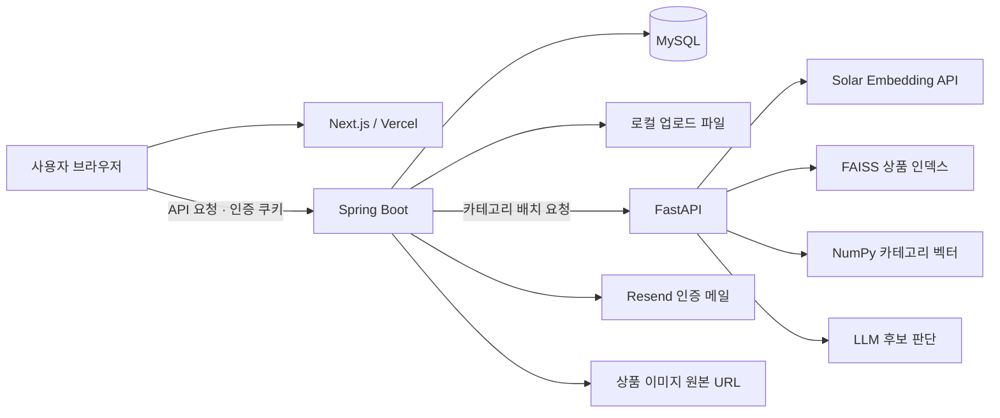
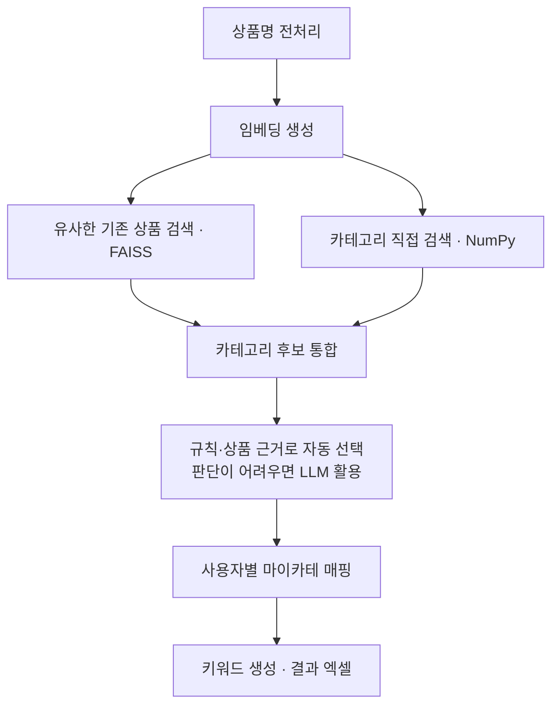

# StorePilot

상품 엑셀을 분석해 사용자별 마이카테고리와 검색 키워드를 채우고, 상품 이미지 가공까지 지원하는 온라인 판매자용 서비스입니다.

[서비스 바로가기](https://storepilot-three.vercel.app/) · [사용 가이드](https://literate-marquis-4cc.notion.site/StorePilot-3d2c3b070b418090809ad8e419b2df0e)

[Backend Repository](https://github.com/storepilot-app/be) · [Frontend Repository](https://github.com/storepilot-app/fe) · [AI Server Repository](https://github.com/storepilot-app/ai-server)

## 📌 프로젝트 소개

스마트 스토어 운영하는 부모님이 상품을 등록할 때마다 적절한 카테고리를 찾고 상품 정보를 정리하는 데 시간을 쓰시는 모습을 보고 개발했습니다.

신상품 엑셀을 업로드하면, 기존 상품 데이터와 카테고리 정보를 기반으로 적합한 네이버 카테고리를 찾습니다. 이를 사용자가 등록한 마이카테고리 코드로 변환하고 검색 키워드와 함께 결과 엑셀에 기록합니다.

개인 프로젝트로 백엔드·AI 서버·프런트엔드를 구현하고 서비스를 배포했으며, 사용 과정에서 받은 피드백을 바탕으로 기능을 개선하고 있습니다.

## 🖥️ 주요 기능

| 기능 | 사용자 경험 |
| --- | --- |
| 카테고리 및 키워드 찾기 | 상품 엑셀 업로드 → 작업 진행률 확인 → 마이카테·키워드가 채워진 엑셀 저장 (현재 1회 1,500개·하루 2,000개 상품 처리 제한) |
| 사용자별 마이카테 매핑 | 사용 중인 매핑 파일을 등록하고 자신의 코드 체계에 맞는 결과 확인 |
| 이미지 다운로드 | 엑셀의 이미지 URL을 읽어 JPEG 저장, 목표 용량 조절 및 실패 목록 엑셀 제공 |
| 워터마크 | 계정별 워터마크 이미지·위치·크기·불투명도 설정 및 다운로드 시 선택 적용 |
| 카테고리 학습 요청 | 기존 상품 파일 제출, 접수·검토·완료·반려 상태 조회 |
| 사용량 관리 | 오늘·이번 달·전체 사용량 조회 |
| 문의 | 자주 묻는 질문, 문의 등록·삭제·답변 확인 |
| 관리자 도구 | 검색 인덱스 관리, 학습 요청 검토, 사용자 사용량 조회, 상품 카테고리 매핑 확인 |

<!-- 공개용 스크린샷 준비 후 이 위치에 추가:
카테고리 및 키워드 찾기(진행률), 이미지 다운로드(실패 목록), 관리자 매핑 확인.
이메일·실제 상품 데이터 등 개인정보/사용자 데이터가 노출되지 않는 테스트 화면을 사용합니다.
-->

## 🏗️ Architecture



- **Frontend:** 파일 선택, 인증 상태, 진행률 폴링, 파일·폴더 저장과 사용자·관리자 화면
- **Backend:** 인증·권한, 사용자 데이터, 비동기 Excel Job, 규칙 기반 키워드 생성, 이미지 가공과 사용량 제한
- **AI Server:** 임베딩 생성, 검색 인덱스 관리, 유사 상품·카테고리 검색과 최종 후보 판단

브라우저는 BE를 직접 호출하며, Next.js 서버가 AI 요청을 중계하지 않습니다. AI 상품 인덱스는 공유하지만 최종 마이카테 매핑과 사용자 데이터 접근은 BE에서 사용자별로 구분합니다.

## 🛠 Tech Stack

| 영역 | 기술 | 사용 목적 |
| --- | --- | --- |
| Backend | Java 21, Spring Boot 4.0.6, Spring MVC | REST API 및 비즈니스 로직 |
| 인증 | Spring Security, BCrypt, JWT | 계정·인증 쿠키·권한 관리 |
| 데이터 | Spring Data JPA, MySQL | 사용자·카테고리·학습 요청·사용량 저장 |
| 파일 처리 | Apache POI 5.4.1, Java ImageIO·Java2D | 엑셀 해석·작성, 이미지 및 워터마크 가공 |
| 외부 연동 | Spring RestClient, Resend | AI 서버·인증 메일 연동 |
| AI | Python 3.12, FastAPI, NumPy, FAISS CPU | 임베딩 검색·카테고리 판단 |
| 임베딩·LLM | Solar Embedding API, OpenAI 호환 Chat API | 벡터 생성·후보 선택 |
| Frontend | Next.js 16.3, React 19, TypeScript, Tailwind CSS 4 | 사용자·관리자 UI |
| 빌드·검증 | Gradle Wrapper, JUnit, Mockito, H2, k6 | 빌드·단위·통합·부하 테스트 |
| 문서·운영 | Springdoc OpenAPI 3.0.0, Actuator, Vercel, Ubuntu | API 문서·상태 확인·배포 |

## 🔍 Category Matching Pipeline


### 검색과 판단

1. **임베딩 생성**  
   전처리한 상품명을 벡터로 변환합니다. 기존 상품 검색에는 passage 모델을, 카테고리 직접 검색에는 query 모델을 사용합니다.

2. **유사 상품과 카테고리 검색**  
   FAISS로 유사한 기존 상품을 검색하고, NumPy 내적으로 카테고리 자체의 유사도를 비교합니다. 상품 검색 결과는 거의 같은 벡터를 제외해 최대 20개를 남기며, 여러 카테고리가 연결된 충돌 상품은 판단 근거에서 제외합니다.

3. **카테고리 후보 통합**  
   상품 검색 결과의 유사도를 바탕으로 카테고리별 지지도를 계산해 상위 5개를 선정합니다. 여기에 중복되지 않는 직접 검색 후보를 최대 5개 추가하여 최종 후보를 최대 10개로 구성합니다.

4. **자동 선택 또는 LLM 판단**  
   등록된 키워드–카테고리 규칙(Alias)에 일치하면 해당 카테고리를 선택합니다. 그렇지 않더라도 상품 근거의 1위 카테고리가 다음 조건을 모두 만족하면 자동 선택합니다.
   - 최대 상품 유사도 **0.90 이상**
   - 유사도 가중 지지도 **75% 이상**
   - 2위와의 지지도 차이 **15%p 이상**
   - 해당 카테고리를 지지하는 상품 **3개 이상**

   자동 선택하기 어려우면 LLM이 후보 중 하나를 선택하거나 매칭을 거절합니다.

5. **사용자별 매핑 및 결과 생성**  
   선택된 네이버 카테고리를 사용자의 마이카테 코드로 변환합니다. 이후 규칙 기반으로 키워드를 생성하고 결과 엑셀을 작성합니다.

### 학습 데이터 처리

동일한 정규화 상품명은 하나로 합치고 연결된 카테고리를 함께 저장합니다. 여러 카테고리가 연결된 상품은 분류 기준이 불명확하므로 카테고리 지지도 계산과 대표 상품 선정에서 제외합니다.
공유 인덱스의 잘못된 데이터가 여러 사용자에게 영향을 줄 수 있어 일반 사용자의 파일 접수와 관리자 인덱스 반영을 분리했습니다.

## ⚙️ Backend Architecture

### 비동기 상품 엑셀 작업

1. 첫 번째 시트의 1행에서 상품명 열을 찾고, 상품 행 수를 검사합니다.
2. 일일 한도를 확인하고, 이번 작업에서 처리할 상품 수만큼 사용량을 DB에 예약합니다.
3. 원본 파일을 임시 디렉터리에 저장하고 전용 Executor에 작업을 등록한 뒤 jobId를 반환합니다.
4. 백그라운드에서 카테고리 예측, 사용자별 매핑 적용, 키워드 생성 및 결과 엑셀 작성을 수행합니다.
5. 성공하면 예약 수량을 완료 사용량으로 전환하고, 처리 예외로 실패하면 예약을 해제합니다. 업로드 임시 파일은 처리 종료 시 삭제합니다.
6. 클라이언트는 jobId로 상태 API를 폴링하여 진행 상황을 표시하고, 완료 후 결과를 다운로드합니다.

작업 상태는 `PENDING → PROCESSING → COMPLETED / FAILED`입니다. 상태 응답에 처리 개수, 전체 개수, 진행률, 단계, 카테고리·키워드 처리 시간이 포함됩니다.

현재 ThreadPoolTaskExecutor는 동시 작업 4개, 대기 큐 50개로 설정되어 있습니다. 요청 스레드에서 파일 검증·사용량 예약·파일 저장을 수행한 뒤 작업을 Executor에 제출하고 작업 ID를 반환합니다. 
이후 엑셀 처리와 완료·실패 처리는 Executor의 작업 스레드에서 수행합니다.
작업 대기열과 상태를 BE 메모리에 보관하므로, 서버 재시작 시 작업 정보를 복구할 수 없습니다.

관련 코드: [작업 서비스](src/main/java/com/be/productexceljob/service/ProductExcelJobService.java), [Executor 설정](src/main/java/com/be/productexceljob/config/ProductExcelJobConfig.java)

### 카테고리 예측과 사용자별 매핑

AI 서버가 예측한 네이버 카테고리를 사용자가 등록한 마이카테고리 코드로 변환합니다. 같은 상품이라도 사용자별 매핑에 따라 최종 마이카테 코드는 달라질 수 있습니다.

- 활성 네이버 카테고리 버전과 목록을 **작업 시작 시 한 번 조회**하여 모든 배치에서 재사용합니다.
- 상품을 기본 **300개씩 나누어** AI 서버에 순차 요청합니다. 서로 다른 엑셀 작업은 동시에 처리할 수 있습니다.
- 예측 결과와 카테고리를 Map으로 관리하고, 예측된 카테고리 코드에 해당하는 사용자 매핑을 일괄 조회합니다.
- 매핑 성공, 네이버 카테고리 예측 실패, 사용자 마이카테 매핑 없음으로 결과를 구분합니다.

관리자는 선택 과정 확인 옵션을 통해 유사상품·카테고리 후보·LLM 판단 상태를 결과 엑셀에서 확인할 수 있습니다. 해당 옵션은 백엔드에서도 관리자 권한을 검증합니다.

관련 코드: [카테고리 매칭](src/main/java/com/be/categorymatcher/service/CategoryMatcherService.java), [배치 처리](src/main/java/com/be/categorymatcher/service/CategoryPredictionBatchProcessor.java)

### 규칙 기반 키워드 생성과 엑셀 작성

상품명·카테고리의 단어, 유사상품에서 반복되는 표현, 동의어 사전과 조합 템플릿을 활용해 키워드 후보를 생성합니다. 후보에 규칙 기반 점수를 부여해 최대 **30개**를 선택하며, 별도의 LLM API를 호출하지 않습니다.

엑셀 처리 흐름을 조율하는 서비스에서 **키워드 생성과 시트 입출력 책임을 분리**하여, 생성 규칙이나 엑셀 양식을 독립적으로 수정할 수 있도록 구성했습니다.

관련 코드: [처리 서비스](src/main/java/com/be/productexceljob/service/ProductExcelProcessingService.java), [키워드 생성기](src/main/java/com/be/productexceljob/service/ProductKeywordGenerator.java), [열 정의](src/main/java/com/be/productexceljob/excel/ProductExcelLayout.java)

### 동시 요청을 고려한 사용량 제한

상품 처리는 **1회 최대 1,500개, 사용자별 하루 최대 2,000개**로 제한하며 관리자에게도 동일하게 적용합니다.

**작업 접수 시 사용량 예약**

작업이 완료된 수량만 확인하면 동시에 접수된 요청들이 모두 잔여 한도를 통과할 수 있습니다. 이를 방지하기 위해 처리 중인 작업의 수량도 예약 사용량으로 관리합니다.

- `완료 수 + 예약 수 + 요청 수 ≤ 일일 한도` 조건 확인과 예약 수량 증가를 **하나의 SQL UPDATE**로 처리합니다.
- 정상 완료하면 예약 수량을 완료 사용량으로 전환하고 작업 횟수를 기록합니다.
- 작업 등록 실패나 처리 예외가 발생하면 예약을 해제합니다.
- 한국 시간(`Asia/Seoul`)의 접수 날짜를 기준으로 처리하므로, 자정을 넘어 완료되어도 같은 날짜의 예약을 정산합니다.

**사용량 저장과 조회**

- 사용자·날짜 조합에 유일 제약을 두고, 최초 사용 시 일별 사용량 행을 생성합니다.
- 월간·전체 누적 사용량은 일별 데이터를 합산합니다.
- 오늘 한도 표시는 완료 수와 예약 수를 합산하여 처리 중인 작업도 포함합니다.
- 관리자 조회는 사용자 기준 `LEFT JOIN`으로 사용량이 0인 사용자도 표시합니다.

이미지 사용량은 **BE의 이미지 처리 성공 시점**에 기록하며, 브라우저의 파일 저장 성공 여부까지 확인하는 것은 아닙니다.

관련 코드: [사용량 서비스](src/main/java/com/be/userusage/service/UserUsageService.java), [예약 쿼리](src/main/java/com/be/userusage/repository/UserUsageRepository.java)

### 이미지 다운로드와 워터마크

`prepare`는 `목록이미지1` 열에서 다운로드 대상을 추출하고, `download`는 해당 URL의 이미지를 받아 가공합니다. 파일 저장 위치 선택과 여러 이미지 요청 조율은 프런트엔드가 담당합니다.

- 원본 비율을 유지하며 흰 배경의 **1,000 × 1,000** 이미지로 변환합니다.
- 요청 시 사용자의 워터마크를 합성하고 JPEG로 인코딩합니다.
- 원본 바이트 크기의 **30~100%**를 목표로 JPEG 품질을 탐색합니다. 최소 품질에서도 목표보다 크면 최소 품질 결과를 반환하므로 정확한 용량 달성을 보장하지 않습니다.
- HTTP(S) URL만 허용하고 내부 주소 및 리다이렉트 목적지를 검사합니다. 원본 다운로드는 20MB, 원본 해상도는 4천만 픽셀로 제한합니다.
- 404·접근 차단·요청 과다 등을 사용자 메시지로 변환하고, 프런트에서 수집한 실패 목록을 엑셀로 생성합니다.
- 워터마크는 사용자당 하나를 MySQL `MEDIUMBLOB`에 저장합니다. 업로드 최대 2MB, 불투명도 10~100%, 크기 5~50%를 허용합니다.

관련 코드: [이미지 서비스](src/main/java/com/be/productimage/service/ProductImageDownloadService.java), [워터마크 서비스](src/main/java/com/be/watermark/service/UserWatermarkService.java)

### 학습 데이터 접수와 관리자 반영

일반 사용자의 업로드는 **학습 요청 접수**만 수행합니다. 자동으로 인덱스를 변경하지 않으며, 관리자가 검토한 뒤 별도의 인덱스 관리 API로 반영합니다.

- 요청 상태: `RECEIVED`, `REVIEWING`, `COMPLETED`, `REJECTED`
- 접수 API는 요청당 `.xlsx` 파일 하나를 받으며 최대 20MB·50,000개 상품을 검사합니다.
- 요청자의 마이카테 파일은 **다운로드 시점의 DB 매핑으로 생성**합니다. 원본이나 접수 당시 스냅샷이 아닙니다.
- 관리자 파일 삭제 시 원본만 지우고 요청 기록을 남기며 상태를 `COMPLETED`로 처리합니다.
- 관리자 인덱스 재생성·추가는 `files`와 `myCategoryFile`을 함께 받습니다. 별도 매핑 파일을 해석해 사용하며, 기존 사용자 매핑을 교체하는 업로드 API와 구분됩니다.

### 인증과 데이터 접근

- 비밀번호는 BCrypt로 저장하고 Access Token은 JWT를 사용합니다.
- Refresh Token은 난수로 발급하고 DB에는 SHA-256 해시를 저장합니다.
- 두 토큰 모두 HttpOnly 쿠키이며 Refresh Token 쿠키 경로는 `/api/v1/auth`입니다.
- 서버 세션은 생성하지 않습니다. 인증 필터는 JWT와 사용자 존재 여부를 확인합니다.
- 마이카테 매핑·문의·작업 상태/결과 등은 로그인 사용자 ID로 접근을 제한합니다.
- 프런트 요청에 `credentials: "include"`가 필요합니다. CORS에 등록된 Origin의 자격 증명 요청을 허용하고 `Content-Disposition`을 노출합니다.

현재 CSRF 보호는 비활성화되어 있습니다. HttpOnly·CORS만으로 모든 CSRF 위험이 해소되는 것은 아니며 운영 강화 항목으로 별도 검토가 필요합니다.

<details>
<summary>API 및 입력 엑셀 규칙</summary>

기본 경로는 `/api/v1`입니다. 인증 공개 경로를 제외한 기능 API는 로그인이 필요하고, `/admin/**`는 `ADMIN` 권한이 필요합니다. 전체 파라미터·DTO는 Swagger UI에서 확인할 수 있습니다. 표의 짧은 경로는 같은 행의 공통 접두사를 생략한 표기입니다.

| 영역 | 메서드·경로 | 설명 |
| --- | --- | --- |
| 인증 공개 | `POST /auth/signup`, `/auth/login`, `/auth/refresh`, `/auth/logout` | 가입·로그인·갱신·로그아웃 |
| 이메일 공개 | `POST /auth/verify-email`, `/auth/verification-email/resend` | 인증·재발송 |
| 비밀번호 공개 | `POST /auth/password-reset/request`, `/auth/password-reset/confirm` | 비밀번호 재설정 |
| 계정 | `GET /auth/me`, `DELETE /auth/me` | 내 정보·탈퇴 |
| 매핑 | `GET /my-category-mappings`, `POST /my-category-mappings/upload` | 조회·교체 |
| 엑셀 작업 | `POST /product-excel-jobs` | `file`, `includeSelectionDetails`로 작업 생성 |
| 엑셀 작업 | `GET /product-excel-jobs/{jobId}/status`, `/{jobId}/download` | 내 작업 상태·결과 |
| 이미지 | `POST /product-excel-jobs/images/prepare`, `/download`, `/failures/excel` | 목록·단건 다운로드·실패 엑셀 |
| 워터마크 | `GET`, `PUT`, `DELETE /users/me/watermark`, `GET /users/me/watermark/image` | 설정 및 이미지 관리 |
| 학습 요청 | `POST`, `GET /training-product-requests` | 파일 접수·내 목록 |
| 관리자 학습 요청 | `GET /admin/training-product-requests` | 전체 목록 |
| 관리자 학습 요청 | `GET /admin/training-product-requests/{requestId}/download`, `/{requestId}/my-category-mappings/download` | 원본·현재 매핑 다운로드 |
| 관리자 학습 요청 | `PATCH /admin/training-product-requests/{requestId}/status`, `DELETE /admin/training-product-requests/{requestId}` | 상태 변경·원본 파일 삭제 |
| 사용량 | `GET /user-usages/me`, `GET /admin/user-usages` | `period=TODAY\|MONTH\|TOTAL` |
| 카테고리 관리 | `POST /admin/naver-categories/upload` | `file`, `skipEmbeddingRebuild` |
| 상품 인덱스 | `POST /admin/training-products/rebuild`, `/append` | `files`, `myCategoryFile` |
| 상품 인덱스 | `POST /admin/training-products/feedback`, `GET /admin/training-products/category-stats` | 피드백·통계 |
| 상품 매핑 확인 | `POST /admin/training-products/mapping-preview` | 관리자 전용. `file`, `myCategoryFile`의 첫 시트를 비교해 상품별 네이버 카테고리·실패 사유 반환. DB 저장·AI 호출 없음 |
| 문의 | `/qna/faqs`, `/qna/questions` | FAQ 조회, 내 문의 조회·등록·삭제 |
| 문의 관리 | `/admin/qna/faqs`, `/admin/qna/questions` | FAQ 등록·수정·노출 변경, 전체 문의 조회·답변 |

일반 JSON 응답은 `CommonResponse<T>`의 `success`, `data`, `message`, `code`, `errors` 구조입니다. 엑셀·이미지 다운로드는 바이너리 응답입니다.

### 입력 엑셀 규칙

첫 번째 시트의 1행 헤더를 기준으로 읽습니다.

| 기능 | 주요 헤더 |
| --- | --- |
| 카테고리·키워드 작업 | `상품명` |
| 이미지 목록 | 필수 `목록이미지1`, 파일명용 선택 `상품코드`, `제품번호` |
| 마이카테 매핑 | `마이카테`, `네이버카테` (`마이카테명`은 현재 필수 해석 대상이 아님) |
| 기존 상품 학습 | `상품명`, `마이카테` (`마이카테고리`, `마이카테고리코드`도 허용) |
| 네이버 카테고리 | `카테고리코드`, `1차카테`, `2차카테`, `3차카테`, `4차카테` |

전역 multipart 제한은 파일당 50MB, 요청당 150MB입니다. 학습 요청·워터마크에는 더 작은 서비스별 제한이 적용됩니다.

</details>

## 💡 Technical Decisions

### 왜 비동기 처리했는가

카테고리 검색과 엑셀 작성은 여러 외부 호출과 파일 처리를 포함합니다. 하나의 HTTP 요청에서 완료까지 기다리는 대신 작업 ID를 먼저 반환하고 상태를 조회하도록 분리했습니다.
전용 Executor로 동시 작업 수와 대기량을 제한합니다. 다만 메모리 기반 큐이므로 재시작 복구를 제공하는 영속 작업 큐와는 다릅니다.

### 왜 FAISS인가

기존 상품의 의미적 유사도를 여러 벡터에 대해 검색하기 위해 사용했습니다. 벡터 검색을 AI 서버 내부에서 수행하며, 별도 벡터 DB를 운영하지 않는 구조입니다.
현재 기본값은 정규화 벡터의 내적을 정확 검색하는 `IndexFlatIP`입니다. HNSW 옵션도 있지만 데이터 규모에 맞춘 정확도·속도·메모리 비교 없이 더 빠르다고 가정하지 않습니다.

### 왜 LLM과 임베딩을 결합했는가

임베딩으로 후보 범위를 좁히고, 상품 근거가 충분하면 자동 선택해 LLM 호출을 생략합니다.
모호한 상품에만 후보 판단을 요청하여 모든 상품을 LLM 단독으로 분류하는 방식의 호출 부담을 줄이도록 설계했습니다.
실제 비용 절감률이나 정확도 향상률은 별도의 평가 데이터로 측정해야 하며 수치로 단정하지 않습니다.

### 왜 배치 처리하는가

상품마다 HTTP 요청을 보내는 대신 기본 300개씩 예측을 요청해 호출 횟수를 줄입니다. 동시에 한 번에 보내는 데이터 크기도 제한합니다.
BE 배치 크기와 임베딩 API의 요청 배치 크기는 별도이며, 한 엑셀 작업의 BE 배치는 순차 처리합니다.

### 왜 사용자별 매핑과 공유 검색 데이터를 분리했는가

네이버 카테고리는 공통 기준으로 검색하되 사용자마다 다른 마이카테 코드를 적용해야 하기 때문입니다.
검색 인덱스와 사용자 매핑을 분리해 공통 상품 사례를 활용하면서 각자의 상품 등록 양식에 맞는 결과를 제공합니다.

## 🔥 Troubleshooting

### 외부 쇼핑 검색 API 의존성

외부 쇼핑 API 환경 변화에 영향을 받는 상품별 검색 방식 대신, 축적한 상품명–카테고리 사례와 카테고리 임베딩을 검색하는 구조를 구현했습니다.
특정 API 전체가 종료되었다는 표현은 사용하지 않습니다. 현재도 임베딩·LLM API 의존성은 있으며, 쇼핑 검색 결과에 대한 의존성을 줄인 설계입니다.

### 대량 처리와 CPU 임베딩 병목

k6로 동시 사용자를 늘렸을 때 HTTP 상태 조회는 빠르게 응답하지만 작업 완료 시간은 길어졌습니다.
AI 단계별 로그를 추가해 임베딩에 소요되는 시간을 확인하고, Executor 동시 작업 수와 AI 연산 스레드 설정을 바꾸어 비교했습니다.
이후 외부 임베딩 API를 도입했으며, 현재의 성능을 과거 로컬 모델 측정값과 혼용하지 않습니다.

### 반복 DB 조회

엑셀 작업의 배치마다 동일한 활성 카테고리를 조회하지 않도록 작업 시작 시 한 번 조회해 재사용했습니다.
카테고리와 예측 결과를 Map으로 관리하고, 예측된 카테고리 코드에 해당하는 사용자 매핑을 일괄 조회하도록 구성했습니다.

### 동시 요청의 사용량 한도 초과

사용량을 읽은 뒤 별도로 증가시키면 동시에 들어온 요청이 모두 잔여량을 통과할 수 있습니다.
예약 수량 증가와 한도 조건을 하나의 SQL UPDATE로 수행하고, 성공·실패 시 예약을 완료 사용량으로 전환하거나 반환하도록 구현했습니다.
프로세스 강제 종료 후 예약을 자동 복구하는 기능은 아직 없습니다.

### 임베딩 API의 429 응답

인덱스 생성과 예측에서 임베딩 호출이 몰리며 요청 한도 오류를 경험했습니다.
Solar 요청 시작 간격을 같은 AI 프로세스의 스레드들이 공유하도록 제한했습니다. 기본 90 RPM이며 실제 계정 한도에 맞춰 조정합니다.
토큰 한도나 다른 프로세스의 호출까지 통제하지 않고, 429 자동 재시도는 현재 구현되어 있지 않습니다.

## 📊 Performance / Test

### 과거 운영 서버 측정

아래는 개발 과정에서 기록한 **로컬 임베딩 사용 당시** k6 결과입니다. 현재 Solar 설정의 벤치마크나 반복 측정 평균이 아닙니다.
서버 CPU는 Intel i5-10210U(4코어·8스레드)였고, 각 VU가 상품 파일로 작업을 한 번 등록했습니다.

| 실행 | 동시 사용자 | 작업 완료 시간 평균 | 큐 대기 관측 평균 | 작업 실패 |
| --- | --- | --- | --- | --- |
| 로컬 임베딩 스레드 설정 조정 후 | 1 VU | 44.63초 | 2.43초 | 0 / 1 |
| 같은 단계의 동시 요청 테스트 | 2 VU | 약 63초 | 2.39초 | 0 / 2 |

2 VU 결과는 두 작업이 순차적으로 각각 63초 걸렸다는 뜻이 아니라, 동시에 시작한 각 작업의 완료 관측 시간이 약 63초였다는 뜻입니다.
샘플 수가 작고 원시 결과 파일·전체 실행 조건을 저장소에 보관하지 않아 서비스 처리 한계나 개선율의 근거로 사용하지 않습니다.

당시 AI 로그의 300개 상품 처리 예에서는 임베딩 약 **28.94초 / 전체 33.98초**가 관측되어, 임베딩 단계가 주요 병목임을 확인했습니다.
현재 모델의 품질·처리량은 동일 파일·인덱스·서버 조건을 고정한 재측정이 필요합니다.

### 테스트 실행과 지표

BE 루트에서 실행합니다.

```powershell
.\gradlew.bat test
.\gradlew.bat bootJar
```

Java가 인식되지 않으면 설치한 JDK 21 경로를 `JAVA_HOME`에 지정합니다. 테스트 DB는 `src/test/resources/application.yml`의 H2 MySQL 호환 모드와 `create-drop` 설정을 사용합니다.

현재 테스트에는 다음 동작이 포함됩니다.

- 카테고리 매칭·사용자 매핑과 키워드 추출·조합·순위
- 엑셀 시트 처리·결과 작성·상품 수 제한·작업 사용량 기록
- 일별 사용량 합산과 예약 한도 쿼리
- 이미지 URL 검증·HTTP 응답·가공·실패 목록 엑셀
- 학습 요청과 문의 처리

H2 테스트 통과가 실제 MySQL의 동시 요청·잠금 동작이나 외부 AI 품질까지 검증한다는 뜻은 아닙니다.

### k6

`load-test/k6/product-excel-job.js`는 로그인 → 작업 생성 → 상태 폴링을 수행합니다. 결과 파일 다운로드는 포함하지 않습니다. 계정 파일과 테스트 엑셀을 준비한 뒤 실행합니다.

```powershell
cd load-test/k6
Copy-Item users.example.json users.local.json
# users.local.json에 가입된 테스트 계정을 입력하고 fixtures/products-small.xlsx를 준비합니다.
k6 run -e VUS=1 -e BASE_URL=http://localhost:8080 product-excel-job.js
```

현재 스크립트는 계정 목록을 순환 사용하므로 VU 수가 계정 수보다 많아도 실행할 수 있습니다. 같은 계정을 공유하면 하루 2,000개 제한도 공유합니다. 반복 테스트 역시 실제 사용량과 AI 호출 비용에 반영되므로 테스트 계정·데이터를 분리해야 합니다.

| 지표 | 의미 |
| --- | --- |
| `http_req_duration` | 로그인·생성·상태 조회 HTTP 응답 시간 |
| `job_duration_ms` | 작업 생성 요청부터 최종 상태 관측까지 소요 시간 |
| `job_queue_wait_ms` | 최초 `PROCESSING` 관측까지 대기 시간 근삿값 |
| `job_failed` | 스크립트에서 관측한 작업 흐름 실패율 |

기본 폴링 간격은 2초라 관측 시간에 오차가 있습니다. BE의 `category_batch_timing`, `category_all_batches_timing` 로그와 AI 서버 로그를 함께 비교해야 HTTP 응답 속도와 실제 작업 처리 속도를 구분할 수 있습니다. 성능을 비교할 때는 상품 수·파일·계정 수·인덱스·모델·서버 조건을 함께 기록해야 합니다.

## 🚀 Deployment

### 운영 구성

| 구성 요소 | 확인된 운영 방식 |
| --- | --- |
| Frontend | Vercel의 Next.js 배포 |
| Backend | Ubuntu 서버에서 Spring Boot 실행, `storepilot-be` systemd 서비스 로그 확인 |
| AI Server | Ubuntu 서버에서 Uvicorn 실행, `storepilot-ai` systemd 서비스 로그 확인 |
| 데이터 | MySQL 및 서버 로컬 업로드·인덱스 디렉터리 |
| Cloudflare / Docker | 이 저장소에 설정 파일이 없어 적용 여부와 역할을 확인할 수 없음 |

Cloudflare의 DNS·프록시 역할이나 Docker 배포를 실제 운영 구성으로 확정해 기술하지 않았습니다.
현재 메모리 작업 큐를 사용하므로 무중단 배포·다중 인스턴스를 지원한다고 설명하지 않습니다.

```bash
# Ubuntu 서비스 로그 확인
journalctl -u storepilot-be -f
journalctl -u storepilot-ai -f
```

<details>
<summary>로컬 실행 및 초기 데이터 준비</summary>

### 사전 준비

- JDK 21
- MySQL 8 계열 및 접속 가능한 DB
- 카테고리 기능을 사용할 경우 별도 StorePilot AI 서버

```sql
CREATE DATABASE storepilot CHARACTER SET utf8mb4 COLLATE utf8mb4_unicode_ci;
```

### 환경 설정

BE 루트에서 예시 파일을 복사합니다. `.env.local`은 Git에서 제외되어 있습니다.

```powershell
Copy-Item .env.example .env.local
```

| 환경변수 | 설정 내용·예시 |
| --- | --- |
| `DB_URL` | `jdbc:mysql://localhost:3306/storepilot?serverTimezone=Asia/Seoul&characterEncoding=UTF-8` |
| `DB_USERNAME`, `DB_PASSWORD` | 로컬 DB 계정 |
| `AI_SERVER_BASE_URL` | `http://127.0.0.1:8000` |
| `STOREPILOT_AUTH_JWT_SECRET` | 환경별 충분히 긴 임의 비밀값으로 교체 |
| `STOREPILOT_AUTH_ACCESS_TOKEN_MINUTES` | 예시: `30` |
| `STOREPILOT_AUTH_REFRESH_TOKEN_DAYS` | 예시: `14` |
| `STOREPILOT_AUTH_ALLOWED_ORIGINS` | 예시: `http://localhost:3000` |
| `STOREPILOT_AUTH_COOKIE_SECURE` | 로컬 HTTP: `false` |
| `STOREPILOT_AUTH_COOKIE_SAME_SITE` | 로컬: `Lax` |
| `STOREPILOT_APP_BASE_URL` | 인증·비밀번호 재설정 링크의 프런트 주소 |
| `STOREPILOT_EMAIL_VERIFICATION_ENABLED` | 로컬 예시: `false` |
| `STOREPILOT_EMAIL_VERIFICATION_TOKEN_MINUTES` | 기본 `30` |
| `STOREPILOT_PASSWORD_RESET_TOKEN_MINUTES` | 기본 `30` |
| `STOREPILOT_RESEND_API_KEY` | 메일 발송 시 설정, 로컬 미사용 시 빈 값 |
| `STOREPILOT_MAIL_FROM` | 인증된 발신자 주소 |

Spring Boot가 `.env.local`을 자동으로 읽지는 않습니다. IntelliJ 실행 환경변수에 등록하거나 PowerShell에서 다음처럼 로드합니다.

```powershell
Get-Content .env.local | Where-Object { $_ -match '^\s*[^#].*=.*$' } | ForEach-Object {
  $settingName, $settingValue = $_.Split('=', 2)
  [Environment]::SetEnvironmentVariable($settingName.Trim(), $settingValue.Trim(), 'Process')
}
.\gradlew.bat bootRun
```

이 로더는 예시 파일과 같은 단순 `KEY=VALUE` 형식용이며 셸의 따옴표·변수 치환 문법을 해석하지 않습니다. macOS/Linux에서는 환경변수를 설정한 뒤 `./gradlew bootRun`을 실행합니다.

- 서버: `http://localhost:8080`
- Swagger UI: `http://localhost:8080/swagger-ui.html`
- OpenAPI JSON: `http://localhost:8080/api-docs`
- 기본 상태 확인: `http://localhost:8080/actuator/health` (AI 준비 완료까지 보장하는 검사는 아님)

### 초기 데이터 준비

1. 계정을 생성합니다. 이메일 인증이 활성화된 환경에서는 인증까지 완료합니다.
2. 초기 관리자 계정을 지정합니다. 역할 변경 후 재로그인해 새 토큰을 발급받습니다.
3. 관리자가 네이버 카테고리 엑셀을 업로드하고 AI 카테고리 인덱스를 준비합니다.
4. 사용자가 자신의 마이카테고리 매핑을 업로드합니다.
5. 관리자가 기존 상품 파일과 그 상품에 해당하는 마이카테 파일로 상품 인덱스를 구성합니다.
6. 상품 엑셀 작업을 실행하고 결과를 확인합니다.

```sql
UPDATE storepilot_users SET role = 'ADMIN' WHERE email = 'admin@example.com';
```

`skipEmbeddingRebuild=true`는 DB 카테고리 업로드만 수행합니다. 해당 버전의 AI 인덱스를 준비하지 않은 상태에서는 정상적인 예측을 기대할 수 없습니다.

</details>

<details>
<summary>BE → AI 연동과 타임아웃</summary>

| BE에서 호출하는 경로 | 용도 |
| --- | --- |
| `POST /ai/categories/rebuild` | 네이버 카테고리 임베딩 재생성 |
| `POST /ai/categories/predict` | 상품명 배치 카테고리 예측 |
| `POST /ai/categories/product-index/rebuild` | 기존 상품 인덱스 재생성 |
| `POST /ai/categories/product-index/feedback` | 단건 피드백 |
| `POST /ai/categories/product-index/feedback/batch` | 추가 상품 일괄 피드백 |

기본 RestClient 연결 타임아웃은 2초, 읽기 타임아웃은 5분입니다. **기존 상품 인덱스 재생성 호출만 읽기 타임아웃 10분**을 사용합니다. 이는 BE→AI HTTP 호출 설정이며 프록시나 브라우저 제한을 함께 변경하지 않습니다.

</details>

<details>
<summary>데이터 저장 위치 및 운영 제약</summary>

| 데이터 | 저장 위치·수명 |
| --- | --- |
| 사용자·토큰·매핑·카테고리·문의·학습 요청 메타데이터·사용량 | MySQL |
| 워터마크 이미지 | MySQL `user_watermarks.image_data` |
| 엑셀 작업 상태·결과 바이트 | BE 메모리 (`ConcurrentHashMap`) |
| 작업 원본 | `uploads/product-excel-jobs/{jobId}/` — 처리 종료 시 삭제 |
| 학습 요청 원본 | `uploads/training-product-requests/` — 관리자 삭제까지 보관 |
| 네이버 카테고리 원본 | `uploads/naver-categories/versions/` — 최근 버전 디렉터리 5개 유지 |
| 활성 카테고리 CSV | `uploads/naver-categories/active/naver_categories.csv` |
| 마이카테고리 업로드 원본 | 저장하지 않음. 해석된 매핑만 DB에 저장 |

상대 경로 `uploads`는 BE 실행 작업 디렉터리를 기준으로 합니다. MySQL과 업로드 디렉터리는 각각 백업 대상입니다.

현재 구현의 범위와 개선이 필요한 부분은 다음과 같습니다.

- **작업 영속화:** 재시작 시 작업 상태·결과와 메모리 큐가 사라집니다. 완료 결과의 만료·자동 정리도 없어 장기 실행 시 메모리 사용량이 증가할 수 있습니다.
- **예약 복구:** 정상 예외 경로에서는 사용량을 반환하지만, 강제 종료나 DB 반환 실패 후 남은 예약을 자동 복구하는 기능은 없습니다.
- **무중단·다중 인스턴스:** 작업 ID가 프로세스별 `AtomicLong`이고 저장소가 메모리이므로 인스턴스 간 공유와 재시작 복구를 구현해야 안전하게 확장할 수 있습니다.
- **외부 호출과 트랜잭션:** 네이버 카테고리 업로드는 DB·파일·AI 호출을 하나의 흐름에서 수행합니다. DB 롤백이 파일·외부 인덱스까지 원복하지 않으며, 추가 상품 반영도 DB와 AI 사이의 원자성을 보장하지 않습니다.
- **예측 실패 구분:** 카테고리 예측의 HTTP 예외는 빈 결과로 처리됩니다. AI 장애가 `매칭없음` 결과로 나타나면서 작업은 완료되고 사용량이 기록될 수 있습니다.
- **DB 변경:** `ddl-auto: update`를 사용하며 Flyway/Liquibase 마이그레이션은 도입하지 않았습니다.
- **관측·배포:** Actuator·처리 시간 로그·k6 스크립트는 있지만 Prometheus/Grafana 연동이나 무중단 배포 구성을 이 저장소에서 제공하지 않습니다.

운영에서 서로 다른 사이트의 HTTPS 프런트·BE를 연결할 때는 허용 Origin을 실제 주소로 설정하고 `COOKIE_SECURE=true`, `COOKIE_SAME_SITE=None`을 검토해야 합니다. 브라우저의 서드파티 쿠키 정책에 따라 차단될 수 있으므로 배포 도메인 구성에 맞춰 확인해야 합니다.

</details>

## 📁 Repository Structure

도메인별 패키지 안에 필요한 `controller`, `service`, `repository`, `domain`, `dto`, `client` 등을 배치합니다.

```text
src/main/java/com/be/
├── auth/                    # 인증, 쿠키, 토큰, 이메일, 계정
├── categorymatcher/         # AI 예측 배치와 사용자별 매핑 적용
├── global/                  # 공통 설정, 응답, 예외
├── keyword/                 # 키워드 추출·조합·사전·순위 규칙
├── mycategory/              # 사용자별 마이카테고리 매핑
├── navercategory/           # 네이버 카테고리 버전·CSV·임베딩 연동
├── productexceljob/         # 작업 큐, 진행률, 엑셀 처리
├── productimage/            # 이미지 HTTP·검증·가공·실패 엑셀
├── qna/                     # FAQ와 사용자 문의
├── trainingproduct/         # 관리자 인덱스 반영·피드백·통계
├── trainingproductrequest/  # 사용자 학습 요청 접수·관리
├── userusage/               # 사용량 집계·예약·제한
└── watermark/               # 사용자 워터마크 저장·설정
```

```text
be/
├── src/main/java/com/be/     # 도메인별 백엔드 코드
├── src/main/resources/      # 애플리케이션 설정·사전
├── src/test/                # 단위·통합 테스트
├── load-test/k6/             # 로그인·작업 생성·상태 폴링 부하 테스트
├── gradle/                  # Gradle Wrapper
└── README.md
```

## 👤 My Contribution

개인 프로젝트로 서비스 기획부터 BE·AI 서버·FE 구현과 배포를 담당했습니다.

- 부모님의 상품 등록 과정에서 반복되는 작업을 파악하고 엑셀 기반 처리 흐름 설계
- Spring Boot API, 사용자별 데이터 접근, 비동기 Excel Job과 진행률 조회 구현
- 상품·카테고리 임베딩 검색, 자동 선택 조건과 LLM 후보 판단 연동
- 일별 사용량 예약과 한도 적용, 관리자·사용자 사용량 화면 구현
- k6 부하 테스트와 단계별 로그를 통한 병목 확인 및 설정 비교
- 이미지 가공·워터마크·문의·학습 요청 등 사용자 피드백 기반 기능 개선
- 키워드 생성·시트 처리·배치 처리의 책임 분리와 테스트·README 정리

사용자 수, 추천 정확도, 처리시간 개선율은 검증된 집계 없이 성과 수치로 기재하지 않습니다.
