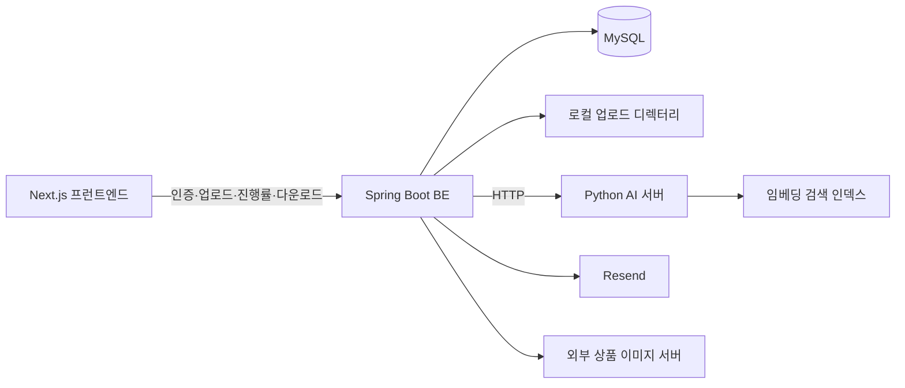

# StorePilot Backend

온라인 판매자의 상품 등록 작업을 돕는 StorePilot의 Spring Boot 백엔드입니다. 유플렛에서 내려받은 상품 엑셀을 입력받아 카테고리 예측을 요청하고, 사용자별 마이카테고리와 검색 키워드를 채운 결과 파일을 제공합니다.

BE는 인증·사용자 데이터·엑셀 작업·이미지 처리·사용량 관리를 담당하고, 임베딩 검색과 카테고리 판단은 별도 Python AI 서버에 위임합니다. 상품마다 카테고리를 직접 선택하고 이미지를 가공해야 하는 반복 작업을 줄이는 것이 목표입니다.

## 기술 스택

| 구분 | 기술 | 역할 |
| --- | --- | --- |
| 언어·빌드 | Java 21, Gradle Wrapper | 빌드 및 테스트 |
| 서버 | Spring Boot 4.0.6, Spring MVC | HTTP API |
| 인증 | Spring Security, BCrypt, JWT | 로그인 및 권한 검사 |
| 데이터 | Spring Data JPA, MySQL | 사용자·매핑·요청·사용량 저장 |
| 엑셀 | Apache POI 5.4.1 | 엑셀 해석 및 결과 작성 |
| 이미지 | Java ImageIO, Java2D, HttpClient | 다운로드·가공·JPEG 인코딩 |
| 외부 연동 | Spring RestClient, Resend | AI 서버 호출·인증 메일 |
| 문서·운영 | Springdoc OpenAPI 3.0.0, Actuator | API 문서·기본 상태 확인 |
| 검증 | JUnit 5, Mockito, H2, k6 | 단위·통합·부하 테스트 |

## 시스템 구성



- **BE:** 사용자별 매핑, 비동기 엑셀 작업, 규칙 기반 키워드 생성, 이미지 가공과 사용량 제한
- **AI 서버:** 카테고리 예측, 카테고리·기존 상품 인덱스 재생성 및 피드백 반영
- **프런트엔드:** 파일 선택, 작업 상태 폴링, 결과 저장, 사용자·관리자 화면

여기서 카테고리 **학습**은 기존 상품과 카테고리 관계를 검색 인덱스에 반영하는 기능을 뜻합니다. BE에서 모델을 직접 학습하거나 파인튜닝하지 않습니다. 임베딩 모델과 외부 AI API 키는 AI 서버에서 설정합니다.

## 주요 기능

| 기능 | 현재 동작 |
| --- | --- |
| 계정 | 이메일 회원가입, 로그인·로그아웃, 이메일 인증·재발송, 비밀번호 재설정, 회원 탈퇴 |
| 마이카테고리 | 사용자별 엑셀 매핑 업로드·조회, 활성 네이버 카테고리와 연결 |
| 카테고리·키워드 | 상품 엑셀 작업 등록, 진행률 조회, 결과 엑셀 다운로드 |
| 이미지 | 다운로드 목록 생성, 단건 이미지 가공, 실패 목록 엑셀 생성 |
| 워터마크 | 사용자별 이미지와 위치·불투명도·크기 저장, 다운로드 시 선택 적용 |
| 학습 요청 | 기존 상품 파일 접수, 관리자 검토·상태 변경·파일 다운로드 |
| 인덱스 관리 | 관리자용 기존 상품 인덱스 재생성, 추가 상품 반영, 피드백·통계 |
| 문의 | FAQ 조회, 내 문의 등록·조회·삭제, 관리자 답변 및 FAQ 관리 |
| 사용량 | 오늘·이번 달·전체 누적 조회, 관리자 사용자별 조회, 상품 처리 한도 |

## 핵심 처리 흐름과 설계

### 비동기 상품 엑셀 작업

1. 첫 번째 시트의 1행에서 `상품명` 열을 찾고, 값이 있는 상품 행 수를 검사합니다.
2. 사용자별 오늘 처리 가능 수량을 DB에서 예약합니다.
3. 원본을 임시 디렉터리에 저장하고 전용 Executor에 작업을 등록한 뒤 `jobId`를 반환합니다.
4. 백그라운드에서 카테고리 예측, 사용자 매핑 적용, 키워드 생성과 결과 엑셀 작성을 수행합니다.
5. 성공 시 예약 수량을 완료 사용량으로 전환합니다. 예외로 실패하면 예약 수량을 반환합니다.
6. 클라이언트는 상태 API를 폴링하고 완료 후 결과를 다운로드합니다. 업로드 임시 파일은 처리 종료 시 삭제합니다.

작업 상태는 `PENDING → PROCESSING → COMPLETED / FAILED`입니다. 상태 응답에 처리 개수, 전체 개수, 진행률, 단계, 카테고리·키워드 처리 시간이 포함됩니다.

현재 `ThreadPoolTaskExecutor`는 **동시 작업 4개, 대기 큐 50개**입니다. 긴 처리를 HTTP 요청 스레드에서 분리한 구조이며 외부 메시지 브로커나 영속 작업 큐는 사용하지 않습니다. 업로드·검증·예약까지는 작업 생성 요청 안에서 수행합니다.

관련 코드: [작업 서비스](src/main/java/com/be/productexceljob/service/ProductExcelJobService.java), [Executor 설정](src/main/java/com/be/productexceljob/config/ProductExcelJobConfig.java)

### 카테고리 예측과 사용자별 매핑

- 한 작업에서 활성 네이버 카테고리 버전과 카테고리 정보를 한 번 읽습니다.
- 동일 버전을 기준으로 기본 **300개씩 순차 배치**로 AI 서버에 요청합니다. 여러 작업은 동시에 실행되지만, 한 작업의 배치가 모두 병렬 실행되는 것은 아닙니다.
- 예측 결과를 `rowId` 기준 Map으로 관리하고 `ActiveNaverCategoryIndex`로 카테고리를 조회합니다.
- 예측된 네이버 카테고리 코드들을 모아 해당 사용자의 매핑을 일괄 조회한 뒤 마이카테고리 코드로 변환합니다.
- 결과는 `MATCHED`, `NO_CATEGORY_MATCH`, `NO_MY_CATEGORY_MAPPING`으로 구분합니다.

같은 상품도 사용자가 등록한 매핑에 따라 최종 마이카테 코드가 달라집니다. AI가 반환하는 후보·유사상품·선택 근거도 결과에 활용하며, 선택 과정 확인용 열은 BE에서도 관리자에게만 허용합니다.

관련 코드: [카테고리 매칭](src/main/java/com/be/categorymatcher/service/CategoryMatcherService.java), [배치 처리](src/main/java/com/be/categorymatcher/service/CategoryPredictionBatchProcessor.java)

### 규칙 기반 키워드 생성과 엑셀 작성

상품명 토큰, 카테고리 토큰, 유사상품 반복 표현, 동의어 사전과 조합 템플릿으로 후보를 만들고 점수순으로 최대 **30개**를 선택합니다. 키워드 생성 자체에 별도 LLM 호출은 없습니다.

처리 조율은 `ProductExcelProcessingService`, 키워드 생성은 `ProductKeywordGenerator`, 시트 입출력은 `ProductExcelSheetProcessor`로 분리했습니다. 파일 경로와 처리 옵션은 `ProductExcelProcessingRequest`로 전달합니다.

입력 상품명은 헤더로 찾지만, **결과는 유플렛 양식의 고정 열에 기록**합니다.

| 결과 위치 | 내용 |
| --- | --- |
| L열 | 키워드 |
| T열 | 마이카테 |
| U열 | 네이버카테 |
| AA~AN열 | 관리자 옵션: 상품명, 유사상품 5개, 선택 카테고리, LLM 상태, 카테고리 검색 결과 5개 |
| 별도 시트 | 키워드 점수와 선정 근거 |

해당 위치의 기존 값은 덮어씁니다. 임의의 엑셀 양식보다는 유플렛 상품 파일을 기준으로 사용해야 합니다.

관련 코드: [처리 서비스](src/main/java/com/be/productexceljob/service/ProductExcelProcessingService.java), [키워드 생성기](src/main/java/com/be/productexceljob/service/ProductKeywordGenerator.java), [열 정의](src/main/java/com/be/productexceljob/excel/ProductExcelLayout.java)

### 동시 요청을 고려한 사용량 제한

- **1회 최대 1,500개**, **사용자별 하루 최대 2,000개** 상품을 허용합니다. 현재 관리자도 동일한 제한을 적용받습니다.
- 한국 시간(`Asia/Seoul`)의 접수 날짜로 예약·완료·반환합니다. 자정을 넘어 완료되어도 접수한 날짜에 기록합니다.
- `user_usages`는 `(user_id, usage_date)`에 유일 제약을 두고 최초 사용 시 행을 생성합니다.
- `완료 수 + 예약 수 + 요청 수 ≤ 2,000` 조건과 예약 증가를 하나의 SQL `UPDATE`에서 처리해 동시 요청의 한도 초과를 방지합니다.
- 정상 완료 시 작업 횟수·처리 상품 수를 증가시키고 예약을 해제합니다. 등록 실패나 처리 예외 시에는 예약만 반환합니다.
- 월·전체 사용량은 일별 데이터를 합산합니다. **연간 조회 옵션과 별도 월별·연별 집계 테이블은 없습니다.**

자기 사용량 API는 완료 수와 예약 수를 별도 필드로 반환합니다. 오늘 한도 표시는 두 값을 더해 사용합니다. 관리자 목록은 사용자 기준 LEFT JOIN으로 사용량이 0인 사용자도 포함합니다.

이미지 사용량은 서버에서 이미지 처리를 완료한 시점에 기록하므로, 브라우저의 로컬 파일 저장 완료를 뜻하지는 않습니다.

관련 코드: [사용량 서비스](src/main/java/com/be/userusage/service/UserUsageService.java), [예약 쿼리](src/main/java/com/be/userusage/repository/UserUsageRepository.java)

### 이미지 다운로드와 워터마크

`prepare`는 `목록이미지1` 열에서 다운로드 대상을 추출하고, `download`는 해당 URL의 이미지를 받아 가공합니다. 파일 저장 위치 선택과 여러 이미지 요청 조율은 프런트엔드가 담당합니다.

- 원본 비율을 유지하며 흰 배경의 **1,000 × 1,000** 이미지로 변환합니다.
- 요청 시 사용자의 워터마크를 합성하고 JPEG로 인코딩합니다.
- 원본 바이트 크기의 **30~100%**를 목표로 JPEG 품질을 탐색합니다. 최소 품질에서도 목표보다 크면 최소 품질 결과를 반환하므로 정확한 용량 달성을 보장하지 않습니다.
- HTTP(S) URL만 허용하고 내부 주소 및 리다이렉트 목적지를 검사합니다. 원본 다운로드는 20MB, 원본 해상도는 4천만 픽셀로 제한합니다.
- 404·접근 차단·요청 과다 등을 사용자 메시지로 변환하고, 프런트에서 수집한 실패 목록을 엑셀로 생성합니다.
- 워터마크는 사용자당 하나를 MySQL `MEDIUMBLOB`에 저장합니다. 업로드 최대 2MB, 불투명도 10~100%, 크기 5~50%를 허용합니다.

관련 코드: [이미지 서비스](src/main/java/com/be/productimage/service/ProductImageDownloadService.java), [워터마크 서비스](src/main/java/com/be/watermark/service/UserWatermarkService.java)

### 학습 데이터 접수와 관리자 반영

일반 사용자의 업로드는 **학습 요청 접수**만 수행합니다. 자동으로 인덱스를 변경하지 않으며, 관리자가 검토한 뒤 별도의 인덱스 관리 API로 반영합니다.

- 요청 상태: `RECEIVED`, `REVIEWING`, `COMPLETED`, `REJECTED`
- 접수 API는 요청당 `.xlsx` 파일 하나를 받으며 최대 20MB·50,000개 상품을 검사합니다.
- 요청자의 마이카테 파일은 **다운로드 시점의 DB 매핑으로 생성**합니다. 원본이나 접수 당시 스냅샷이 아닙니다.
- 관리자 파일 삭제 시 원본만 지우고 요청 기록을 남기며 상태를 `COMPLETED`로 처리합니다.
- 관리자 인덱스 재생성·추가는 `files`와 `myCategoryFile`을 함께 받습니다. 별도 매핑 파일을 해석해 사용하며, 기존 사용자 매핑을 교체하는 업로드 API와 구분됩니다.

## 패키지 구조

도메인별 패키지 안에 필요한 `controller`, `service`, `repository`, `domain`, `dto`, `client` 등을 배치합니다.

```text
src/main/java/com/be/
├── auth/                    # 인증, 쿠키, 토큰, 이메일, 계정
├── categorymatcher/         # AI 예측 배치와 사용자별 매핑 적용
├── global/                  # 공통 설정, 응답, 예외
├── keyword/                 # 키워드 추출·조합·사전·순위 규칙
├── mycategory/              # 사용자별 마이카테고리 매핑
├── navercategory/           # 네이버 카테고리 버전·CSV·임베딩 연동
├── productexceljob/         # 작업 큐, 진행률, 엑셀 처리
├── productimage/            # 이미지 HTTP·검증·가공·실패 엑셀
├── qna/                     # FAQ와 사용자 문의
├── trainingproduct/         # 관리자 인덱스 반영·피드백·통계
├── trainingproductrequest/  # 사용자 학습 요청 접수·관리
├── userusage/               # 사용량 집계·예약·제한
└── watermark/               # 사용자 워터마크 저장·설정
```

## API 개요

기본 경로는 `/api/v1`입니다. 인증 공개 경로를 제외한 기능 API는 로그인이 필요하고, `/admin/**`는 `ADMIN` 권한이 필요합니다. 전체 파라미터·DTO는 Swagger UI에서 확인할 수 있습니다. 표의 짧은 경로는 같은 행의 공통 접두사를 생략한 표기입니다.

| 영역 | 메서드·경로 | 설명 |
| --- | --- | --- |
| 인증 공개 | `POST /auth/signup`, `/auth/login`, `/auth/refresh`, `/auth/logout` | 가입·로그인·갱신·로그아웃 |
| 이메일 공개 | `POST /auth/verify-email`, `/auth/verification-email/resend` | 인증·재발송 |
| 비밀번호 공개 | `POST /auth/password-reset/request`, `/auth/password-reset/confirm` | 비밀번호 재설정 |
| 계정 | `GET /auth/me`, `DELETE /auth/me` | 내 정보·탈퇴 |
| 매핑 | `GET /my-category-mappings`, `POST /my-category-mappings/upload` | 조회·교체 |
| 엑셀 작업 | `POST /product-excel-jobs` | `file`, `includeSelectionDetails`로 작업 생성 |
| 엑셀 작업 | `GET /product-excel-jobs/{jobId}/status`, `/{jobId}/download` | 내 작업 상태·결과 |
| 이미지 | `POST /product-excel-jobs/images/prepare`, `/download`, `/failures/excel` | 목록·단건 다운로드·실패 엑셀 |
| 워터마크 | `GET`, `PUT`, `DELETE /users/me/watermark`, `GET /users/me/watermark/image` | 설정 및 이미지 관리 |
| 학습 요청 | `POST`, `GET /training-product-requests` | 파일 접수·내 목록 |
| 관리자 학습 요청 | `GET /admin/training-product-requests` | 전체 목록 |
| 관리자 학습 요청 | `GET /admin/training-product-requests/{requestId}/download`, `/{requestId}/my-category-mappings/download` | 원본·현재 매핑 다운로드 |
| 관리자 학습 요청 | `PATCH /admin/training-product-requests/{requestId}/status`, `DELETE /admin/training-product-requests/{requestId}` | 상태 변경·원본 파일 삭제 |
| 사용량 | `GET /user-usages/me`, `GET /admin/user-usages` | `period=TODAY\|MONTH\|TOTAL` |
| 카테고리 관리 | `POST /admin/naver-categories/upload` | `file`, `skipEmbeddingRebuild` |
| 상품 인덱스 | `POST /admin/training-products/rebuild`, `/append` | `files`, `myCategoryFile` |
| 상품 인덱스 | `POST /admin/training-products/feedback`, `GET /admin/training-products/category-stats` | 피드백·통계 |
| 상품 매핑 확인 | `POST /admin/training-products/mapping-preview` | 관리자 전용. `file`, `myCategoryFile`의 첫 시트를 비교해 상품별 네이버 카테고리·실패 사유 반환. DB 저장·AI 호출 없음 |
| 문의 | `/qna/faqs`, `/qna/questions` | FAQ 조회, 내 문의 조회·등록·삭제 |
| 문의 관리 | `/admin/qna/faqs`, `/admin/qna/questions` | FAQ 등록·수정·노출 변경, 전체 문의 조회·답변 |

일반 JSON 응답은 `CommonResponse<T>`의 `success`, `data`, `message`, `code`, `errors` 구조입니다. 엑셀·이미지 다운로드는 바이너리 응답입니다.

### 입력 엑셀 규칙

첫 번째 시트의 1행 헤더를 기준으로 읽습니다.

| 기능 | 주요 헤더 |
| --- | --- |
| 카테고리·키워드 작업 | `상품명` |
| 이미지 목록 | 필수 `목록이미지1`, 파일명용 선택 `상품코드`, `제품번호` |
| 마이카테 매핑 | `마이카테`, `네이버카테` (`마이카테명`은 현재 필수 해석 대상이 아님) |
| 기존 상품 학습 | `상품명`, `마이카테` (`마이카테고리`, `마이카테고리코드`도 허용) |
| 네이버 카테고리 | `카테고리코드`, `1차카테`, `2차카테`, `3차카테`, `4차카테` |

전역 multipart 제한은 파일당 50MB, 요청당 150MB입니다. 학습 요청·워터마크에는 더 작은 서비스별 제한이 적용됩니다.

## 인증과 사용자 데이터 분리

- 비밀번호는 BCrypt로 저장하고 Access Token은 JWT를 사용합니다.
- Refresh Token은 난수로 발급하고 DB에는 SHA-256 해시를 저장합니다.
- 두 토큰 모두 HttpOnly 쿠키이며 Refresh Token 쿠키 경로는 `/api/v1/auth`입니다.
- 서버 세션은 생성하지 않습니다. 인증 필터는 JWT와 사용자 존재 여부를 확인합니다.
- 마이카테 매핑·문의·작업 상태/결과 등은 로그인 사용자 ID로 접근을 제한합니다.
- 프런트 요청에 `credentials: "include"`가 필요합니다. CORS에 등록된 Origin의 자격 증명 요청을 허용하고 `Content-Disposition`을 노출합니다.

현재 CSRF 보호는 비활성화되어 있습니다. HttpOnly·CORS만으로 모든 CSRF 위험이 해소되는 것은 아니며 운영 강화 항목으로 별도 검토가 필요합니다.

## 로컬 실행

### 사전 준비

- JDK 21
- MySQL 8 계열 및 접속 가능한 DB
- 카테고리 기능을 사용할 경우 별도 StorePilot AI 서버

```sql
CREATE DATABASE storepilot CHARACTER SET utf8mb4 COLLATE utf8mb4_unicode_ci;
```

### 환경 설정

BE 루트에서 예시 파일을 복사합니다. `.env.local`은 Git에서 제외되어 있습니다.

```powershell
Copy-Item .env.example .env.local
```

| 환경변수 | 설정 내용·예시 |
| --- | --- |
| `DB_URL` | `jdbc:mysql://localhost:3306/storepilot?serverTimezone=Asia/Seoul&characterEncoding=UTF-8` |
| `DB_USERNAME`, `DB_PASSWORD` | 로컬 DB 계정 |
| `AI_SERVER_BASE_URL` | `http://127.0.0.1:8000` |
| `STOREPILOT_AUTH_JWT_SECRET` | 환경별 충분히 긴 임의 비밀값으로 교체 |
| `STOREPILOT_AUTH_ACCESS_TOKEN_MINUTES` | 예시: `30` |
| `STOREPILOT_AUTH_REFRESH_TOKEN_DAYS` | 예시: `14` |
| `STOREPILOT_AUTH_ALLOWED_ORIGINS` | 예시: `http://localhost:3000` |
| `STOREPILOT_AUTH_COOKIE_SECURE` | 로컬 HTTP: `false` |
| `STOREPILOT_AUTH_COOKIE_SAME_SITE` | 로컬: `Lax` |
| `STOREPILOT_APP_BASE_URL` | 인증·비밀번호 재설정 링크의 프런트 주소 |
| `STOREPILOT_EMAIL_VERIFICATION_ENABLED` | 로컬 예시: `false` |
| `STOREPILOT_EMAIL_VERIFICATION_TOKEN_MINUTES` | 기본 `30` |
| `STOREPILOT_PASSWORD_RESET_TOKEN_MINUTES` | 기본 `30` |
| `STOREPILOT_RESEND_API_KEY` | 메일 발송 시 설정, 로컬 미사용 시 빈 값 |
| `STOREPILOT_MAIL_FROM` | 인증된 발신자 주소 |

Spring Boot가 `.env.local`을 자동으로 읽지는 않습니다. IntelliJ 실행 환경변수에 등록하거나 PowerShell에서 다음처럼 로드합니다.

```powershell
Get-Content .env.local | Where-Object { $_ -match '^\s*[^#].*=.*$' } | ForEach-Object {
  $settingName, $settingValue = $_.Split('=', 2)
  [Environment]::SetEnvironmentVariable($settingName.Trim(), $settingValue.Trim(), 'Process')
}
.\gradlew.bat bootRun
```

이 로더는 예시 파일과 같은 단순 `KEY=VALUE` 형식용이며 셸의 따옴표·변수 치환 문법을 해석하지 않습니다. macOS/Linux에서는 환경변수를 설정한 뒤 `./gradlew bootRun`을 실행합니다.

- 서버: `http://localhost:8080`
- Swagger UI: `http://localhost:8080/swagger-ui.html`
- OpenAPI JSON: `http://localhost:8080/api-docs`
- 기본 상태 확인: `http://localhost:8080/actuator/health` (AI 준비 완료까지 보장하는 검사는 아님)

### 초기 데이터 준비

1. 계정을 생성합니다. 이메일 인증이 활성화된 환경에서는 인증까지 완료합니다.
2. 초기 관리자 계정을 지정합니다. 역할 변경 후 재로그인해 새 토큰을 발급받습니다.
3. 관리자가 네이버 카테고리 엑셀을 업로드하고 AI 카테고리 인덱스를 준비합니다.
4. 사용자가 자신의 마이카테고리 매핑을 업로드합니다.
5. 관리자가 기존 상품 파일과 그 상품에 해당하는 마이카테 파일로 상품 인덱스를 구성합니다.
6. 상품 엑셀 작업을 실행하고 결과를 확인합니다.

```sql
UPDATE storepilot_users SET role = 'ADMIN' WHERE email = 'admin@example.com';
```

`skipEmbeddingRebuild=true`는 DB 카테고리 업로드만 수행합니다. 해당 버전의 AI 인덱스를 준비하지 않은 상태에서는 정상적인 예측을 기대할 수 없습니다.

## AI 서버 연동

| BE에서 호출하는 경로 | 용도 |
| --- | --- |
| `POST /ai/categories/rebuild` | 네이버 카테고리 임베딩 재생성 |
| `POST /ai/categories/predict` | 상품명 배치 카테고리 예측 |
| `POST /ai/categories/product-index/rebuild` | 기존 상품 인덱스 재생성 |
| `POST /ai/categories/product-index/feedback` | 단건 피드백 |
| `POST /ai/categories/product-index/feedback/batch` | 추가 상품 일괄 피드백 |

기본 RestClient 연결 타임아웃은 2초, 읽기 타임아웃은 5분입니다. **기존 상품 인덱스 재생성 호출만 읽기 타임아웃 10분**을 사용합니다. 이는 BE→AI HTTP 호출 설정이며 프록시나 브라우저 제한을 함께 변경하지 않습니다.

## 데이터 저장과 운영 제약

| 데이터 | 저장 위치·수명 |
| --- | --- |
| 사용자·토큰·매핑·카테고리·문의·학습 요청 메타데이터·사용량 | MySQL |
| 워터마크 이미지 | MySQL `user_watermarks.image_data` |
| 엑셀 작업 상태·결과 바이트 | BE 메모리 (`ConcurrentHashMap`) |
| 작업 원본 | `uploads/product-excel-jobs/{jobId}/` — 처리 종료 시 삭제 |
| 학습 요청 원본 | `uploads/training-product-requests/` — 관리자 삭제까지 보관 |
| 네이버 카테고리 원본 | `uploads/naver-categories/versions/` — 최근 버전 디렉터리 5개 유지 |
| 활성 카테고리 CSV | `uploads/naver-categories/active/naver_categories.csv` |
| 마이카테고리 업로드 원본 | 저장하지 않음. 해석된 매핑만 DB에 저장 |

상대 경로 `uploads`는 BE 실행 작업 디렉터리를 기준으로 합니다. MySQL과 업로드 디렉터리는 각각 백업 대상입니다.

현재 구현의 범위와 개선이 필요한 부분은 다음과 같습니다.

- **작업 영속화:** 재시작 시 작업 상태·결과와 메모리 큐가 사라집니다. 완료 결과의 만료·자동 정리도 없어 장기 실행 시 메모리 사용량이 증가할 수 있습니다.
- **예약 복구:** 정상 예외 경로에서는 사용량을 반환하지만, 강제 종료나 DB 반환 실패 후 남은 예약을 자동 복구하는 기능은 없습니다.
- **무중단·다중 인스턴스:** 작업 ID가 프로세스별 `AtomicLong`이고 저장소가 메모리이므로 인스턴스 간 공유와 재시작 복구를 구현해야 안전하게 확장할 수 있습니다.
- **외부 호출과 트랜잭션:** 네이버 카테고리 업로드는 DB·파일·AI 호출을 하나의 흐름에서 수행합니다. DB 롤백이 파일·외부 인덱스까지 원복하지 않으며, 추가 상품 반영도 DB와 AI 사이의 원자성을 보장하지 않습니다.
- **예측 실패 구분:** 카테고리 예측의 HTTP 예외는 빈 결과로 처리됩니다. AI 장애가 `매칭없음` 결과로 나타나면서 작업은 완료되고 사용량이 기록될 수 있습니다.
- **DB 변경:** `ddl-auto: update`를 사용하며 Flyway/Liquibase 마이그레이션은 도입하지 않았습니다.
- **관측·배포:** Actuator·처리 시간 로그·k6 스크립트는 있지만 Prometheus/Grafana 연동이나 무중단 배포 구성을 이 저장소에서 제공하지 않습니다.

운영에서 서로 다른 사이트의 HTTPS 프런트·BE를 연결할 때는 허용 Origin을 실제 주소로 설정하고 `COOKIE_SECURE=true`, `COOKIE_SAME_SITE=None`을 검토해야 합니다. 브라우저의 서드파티 쿠키 정책에 따라 차단될 수 있으므로 배포 도메인 구성에 맞춰 확인해야 합니다.

## 테스트와 부하 측정

BE 루트에서 실행합니다.

```powershell
.\gradlew.bat test
.\gradlew.bat bootJar
```

Java가 인식되지 않으면 설치한 JDK 21 경로를 `JAVA_HOME`에 지정합니다. 테스트 DB는 `src/test/resources/application.yml`의 H2 MySQL 호환 모드와 `create-drop` 설정을 사용합니다.

현재 테스트에는 다음 동작이 포함됩니다.

- 카테고리 매칭·사용자 매핑과 키워드 추출·조합·순위
- 엑셀 시트 처리·결과 작성·상품 수 제한·작업 사용량 기록
- 일별 사용량 합산과 예약 한도 쿼리
- 이미지 URL 검증·HTTP 응답·가공·실패 목록 엑셀
- 학습 요청과 문의 처리

H2 테스트 통과가 실제 MySQL의 동시 요청·잠금 동작이나 외부 AI 품질까지 검증한다는 뜻은 아닙니다.

### k6

`load-test/k6/product-excel-job.js`는 로그인 → 작업 생성 → 상태 폴링을 수행합니다. 결과 파일 다운로드는 포함하지 않습니다. 계정 파일과 테스트 엑셀을 준비한 뒤 실행합니다.

```powershell
cd load-test/k6
Copy-Item users.example.json users.local.json
# users.local.json에 가입된 테스트 계정을 입력하고 fixtures/products-small.xlsx를 준비합니다.
k6 run -e VUS=1 -e BASE_URL=http://localhost:8080 product-excel-job.js
```

현재 스크립트는 계정 목록을 순환 사용하므로 VU 수가 계정 수보다 많아도 실행할 수 있습니다. 같은 계정을 공유하면 하루 2,000개 제한도 공유합니다. 반복 테스트 역시 실제 사용량과 AI 호출 비용에 반영되므로 테스트 계정·데이터를 분리해야 합니다.

| 지표 | 의미 |
| --- | --- |
| `http_req_duration` | 로그인·생성·상태 조회 HTTP 응답 시간 |
| `job_duration_ms` | 작업 생성 요청부터 최종 상태 관측까지 소요 시간 |
| `job_queue_wait_ms` | 최초 `PROCESSING` 관측까지 대기 시간 근삿값 |
| `job_failed` | 스크립트에서 관측한 작업 흐름 실패율 |

기본 폴링 간격은 2초라 관측 시간에 오차가 있습니다. BE의 `category_batch_timing`, `category_all_batches_timing` 로그와 AI 서버 로그를 함께 비교해야 HTTP 응답 속도와 실제 작업 처리 속도를 구분할 수 있습니다. 성능을 비교할 때는 상품 수·파일·계정 수·인덱스·모델·서버 조건을 함께 기록해야 합니다.
